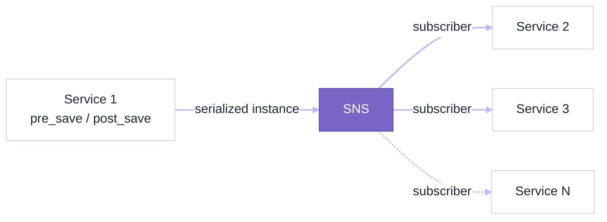
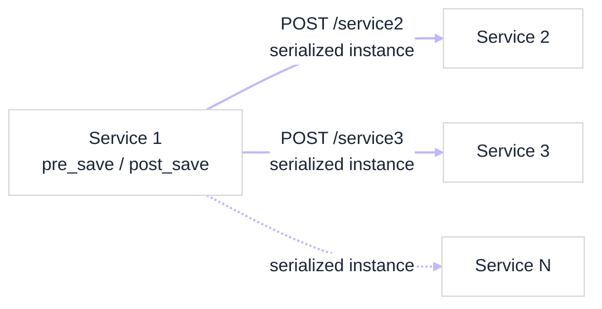

# django-signalhooks

[](https://app.travis-ci.com/github/Internetworkexpert/django-signalhooks)
[](https://codecov.io/gh/Internetworkexpert/django-signalhooks)

> A reusable Django package that turns Django Signals into outbound
> notifications (AWS SNS or HTTP webhooks) so distributed services stay in sync.

| Field | Value |
|---|---|
| **Owner** | INE Engineering |
| **Slack** | [#all-developers](https://slack.com/app_redirect?channel=GS8K9MV0V) · [#dev-team](https://slack.com/app_redirect?channel=C05UPTNP7EV) |
| **Status** | Active |
| **Type** | Python package |
| **Last reviewed** | 2026-06-26 — @jkahgee |

## Overview

`django-signalhooks` provides a set of useful hooks that you can attach to your
Django Signals to notify other services when a Signal is triggered. All you need
to do is connect the
[Django Signal](https://docs.djangoproject.com/en/3.0/ref/signals/) you want
with the hook that better fits your needs.

### The problem

Microservice architectures are great, but keeping services synchronized about
distributed events can be very challenging.

Sample use case:

```text
When "Model X" is created in "Service 1", update "Model Y" attributes in "Service 2".
```

In a monolithic app this use case would be very simple to solve, but in
distributed architectures it gets a little more complicated. `Service 2` needs to
be notified when a new instance of `Model X` is created, and needs to receive the
new instance attributes (fields in the Model) in order to perform its actions.

A more complex use case:

```text
When "Model X" is deleted in "Service 1", do "X" in "Service 2" and "Y" in "Service 3".
```

Many subscribers might be interested in listening when `Model X` instances get
updated/deleted. And all services might be interested in receiving the instance
attributes/ID to react accordingly.

### Supported hooks

Currently, these are the supported hooks:

- `SNSSignalHook`: Publishes a message to an AWS SNS Topic each time a Signal is
  triggered.
- `HTTPSignalHook`: Performs an HTTP(S) webhook request each time a Signal is
  triggered.
- Any other idea?
  [Create an issue](https://github.com/Internetworkexpert/django-signalhooks/issues/new).

## Getting Started

### Install

```bash
pip install signalhooks
```

### Quick start

```python
from django.db.models.signals import post_save
from signalhooks.hooks import SNSSignalHook, HTTPSignalHook

from myapp.models import Pizza


# SNS hooks
sns_hook = SNSSignalHook(
    sns_topic_arn="arn:aws:sns:us-east-1:585698547586:your-topic")
post_save.connect(sns_hook, sender=Pizza)


# HTTP(S) hooks
http_hook = HTTPSignalHook(
    request_url="https://my-other-microservice.app/api/v1/callback")
post_save.connect(http_hook, sender=Pizza)
```

🎉 Start receiving notifications!

## Usage

### SNSSignalHook



[Amazon Simple Notification Service](https://aws.amazon.com/sns) (SNS) is a great
option to keep your microservices synchronized. It's a pubsub solution where one
service can publish notifications to a "topic", and any other services can
subscribe to receive those notifications.

`SNSSignalHook` lets you send an SNS notification to a certain topic when a Django
Signal is triggered. If the Signal is an instance of
[ModelSignal](https://docs.djangoproject.com/en/3.0/ref/signals/#module-django.db.models.signals),
the SNS notification will serialize the sender instance as JSON and send it in
the notification payload as `base64`-encoded.

#### How to use it

```python
# signals.py

from django.db.models.signals import post_save
from signalhooks.hooks import SNSSignalHook

from myapp.models import Pizza


hook = SNSSignalHook(
    sns_topic_arn="arn:aws:sns:us-east-1:585698547586:your-topic"
)
post_save.connect(hook, sender=Pizza)
```

Make sure you configure your target services as subscribers of the SNS Topic you
connected the Signal to.

#### Sample SNS notification body

The notification published to SNS will look similar to this:

```python
sns_client.publish(
    TopicArn="arn:aws:sns:us-east-1:585698547586:your-topic",
    Message="Django Signal triggered",
    MessageAttributes={
        "Event": {
            "DataType": "String",
            "StringValue": "myapp.Pizza:created",
        },
        "InstanceId": {
            "DataType": "String",
            "StringValue": "25",
        },
        "Instance": {
            "DataType": "String",
            "StringValue": "eyJtb2RlbCI6ICJhcHAucGl6emEiLCAicGsiOiAyNCwgImZpZWxkcyI6IHsibmFtZSI6ICJOYXBvbGl0YW5hIiwgInByaWNlIjogIjEwLjUwIn19",
        },
    },
)
```

Note that `"Instance"` is a JSON serialization of your `Pizza` model, encoded as
`base64` to allow transportation in a JSON payload.

### New Nested JSON Serializer

Note: This feature is available since `v0.1.4` and only for `SNSSignalHook`.

The default JSON serializer serializes the primary key or natural keys for
ForeignKey or ManyToMany relationships. This is not helpful if we need to know
additional information about the nested fields. Now we have a new Nested
Serializer to do this job.

We have three new initial parameters:

- `serializer`: receives the serializer to use, `json` by default
- `nested_fields`: an array of nested fields to be serialized. They could be at
  any nested level.
- `max_depth`: object nesting level needed.

If nested_fields or max_depth are missing, it will behave like default
serializer.

### Serializer registration

The first thing we need to do is register as a serializer.

```python
from django.core.serializers import register_serializer

register_serializer("json.nested", "signalhooks.serializer.nested")
```

Now we are ready to initialize the SNSSignalHook.

### Examples

Suppose that a model `C` is an attribute of model `B` with model `B` being an
attribute of `A`.

```python
sns_hook = SNSSignalHook(
    sns_topic_arn="arn:aws:sns:us-east-1:0123456789:your-topic",
    serializer="json.nested",
    nested_fields=["b"],
    max_depth=1,
)
```

This config will serialize all the non Primary Key or M2M attributes of `b` and
the primary key of `c`

If we do

```python
sns_hook = SNSSignalHook(
    sns_topic_arn="arn:aws:sns:us-east-1:0123456789:your-topic",
    serializer="json.nested",
    nested_fields=["b", "c"],
    max_depth=2,
)
```

This config will serialize all the non Primary Key or M2M attributes of `b` and
the non PK or m2m attributes of `c`

### HTTPSignalHook



Performs a HTTP(S) webhook request to given URL each time the Signal is
triggered.

#### How to use it

```python
# signals.py

from django.db.models.signals import post_save
from signalhooks.hooks import HTTPSignalHook

from myapp.models import Pizza


hook = HTTPSignalHook(
    request_url="https://my-other-service.app/hook-callback",
    request_method="POST"
)
post_save.connect(hook, sender=Pizza)
```

#### Connect to multiple services

```python
# signals.py

from django.db.models.signals import post_save
from signalhooks.hooks import HTTPSignalHook

from myapp.models import Pizza

# Service 1
hook_service1 = HTTPSignalHook(
    request_url="https://my-service-1.app/hook-callback")
post_save.connect(hook_service1, sender=Pizza)

# Service 2
hook_service2 = HTTPSignalHook(
    request_url="https://my-service-2.app/hook-callback")
post_save.connect(hook_service2, sender=Pizza)
```

Each time the `Pizza` model is saved, both `Service 1` and `Service 2` will get
notified.

## Development

This package is managed with [Poetry](https://python-poetry.org/). Install
dependencies into a virtual environment with:

```bash
poetry install
```

### Testing

Run the test suite (pytest, with coverage reported against the `signalhooks`
package) via the `Makefile`:

```bash
make test
```

The `build` target additionally enforces formatting and linting before running
the coverage gate:

```bash
make build
```

It runs `black --check`, `pylint` (using `.pylintrc`), and `pytest` with a
`--cov-fail-under=90` coverage threshold.

## CI

Continuous integration runs on [Travis CI](https://www.travis-ci.com/), configured
in [`.travis.yml`](.travis.yml). On each push the pipeline:

- Builds against Python `3.8` and `3.7`.
- Installs dependencies with Poetry (`pip install poetry` then `poetry install`).
- Runs `make build`, which enforces `black --check` and `pylint`, then runs
  `pytest` against the `--cov-fail-under=90` coverage gate.
- Reports coverage to [Codecov](https://codecov.io/) via `codecov` on success.

This is the same `make build` target documented in the
[Development](#development) section, so a local `make build` mirrors what CI
enforces.

## License

This project is licensed under the terms of the [LICENSE](LICENSE) file.
